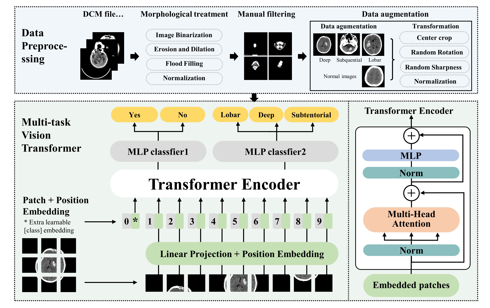

# ICH-classification

This repository includes source code and dataset link for the manuscript: "Dual-Task Vision Transformer for Rapid and Accurate Intracerebral Hemorrhage Classification on CT Images", [arxiv_link](https://arxiv.org/abs/2405.06814.)

## Abstract 
Intracerebral hemorrhage (ICH) is a severe and sudden medical condition caused by the rupture of blood vessels in the brain, leading to permanent damage to brain tissue and often resulting in functional disabilities or death in patients. Diagnosis and analysis of ICH typically rely on brain CT imaging. Given the urgency of ICH conditions, early treatment is crucial, necessitating rapid analysis of CT images to formulate tailored treatment plans. However, the complexity of ICH CT images and the frequent scarcity of specialist radiologists pose significant challenges. Therefore, we built a dataset for ICH and normal classification and three types of ICH image classification based on the hemorrhage location, i.e., Deep, Subcortical, and Lobar. In addition, we propose a dual-task vision transformer (DTViT) for the automated classification and diagnosis of ICH images. This neural network utilizes the encoder from ViT, employing attention mechanisms for feature extraction from CT images. We incorporated two multilayer perception (MLP)-based decoders within the network to simultaneously identify the presence of ICH and classify three types of hemorrhage locations. Experimental results demonstrate that our proposed multi-classification network performs well on the built real-world test dataset. The code and dataset for this study will be made publicly available upon paper acceptance at: this https URL.

### More details are coming soon...

